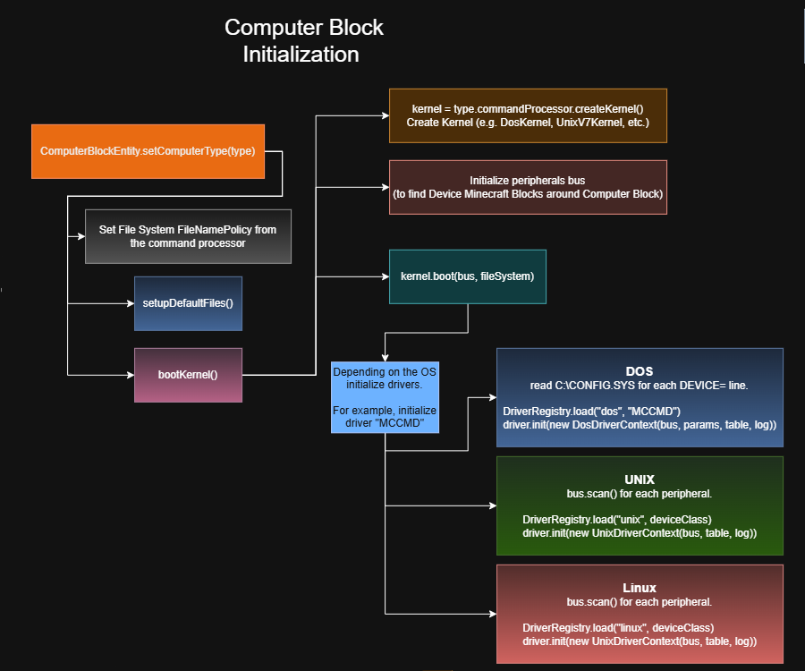

# Computer Block Initialization

## Pipeline

Everytime player clicks Right Mouse Button on `ComputerBlock` the Minecraft function `use(...)` is called.

The player uses the block. On both sides, `.use()` fires. The **CLIENT-SIDE** `use()` opens the terminal screen; the **SERVER-SIDE** boots the machine. The two happen concurrently.

On the server, `use()` calls `ComputerBlockEntity.setComputerType(type)`. This method processes the following:

1. Tell the filesystem which naming policy to use.

   A DOS machine canonicalizes every filename to uppercase 8.3 form (ABCDEFGH.TXT), and looks names up case-insensitively.

   A Linux machine is case-sensetive and would treat "Readme.txt" and "readme.txt" as two separate files. The policy comes from the command processor.

2. If it's first-time boot for the machine then setup the root filesystem. More specifically, go through `ComputerType.defaultFiles`. A list which has elements like **"COMMAND.COM", "DOS/", "DOS/QBASIC.EXE"**. Create corresponding node for each.

   Directories get created implicitly if a path has multiple segments.

   For files, it asks the executable registry for a template body if the name matches a registered executable, and otherwise asks the command processor for default content. Therefore **QBASIC.EXE** gets an MZ header (because it has an executable registry), and **CONFIG.SYS** gets **DEVICE=** line, and neither of those decisions lives in the block entity itself.

3. Setup **ENVIRONMENT** variables. **PATH** gets the default search path from the command processor (For MS-DOS `C:\DOS;C:\`; For UNIX `/bin:/usr/bin`; etc.). **COMSPEC**, **PROMPT**, and anything else the OS needs are written here too. This map is what **SET** (MS-DOS command), **export** (Linux), and every fenvironment-variable expansion will read.

4. Boot the kernel.

   - The block entity asks the command processor reference fresh new kernel: `processor.createKernel()`. For a **MS-DOS** machine this returns `new DosKernel()`; for a **UNIX v7** machine, `new UnixV7Kernel()`; for **Linux**, `new LinuxKernel()`; and so on. 

   - Then initialize `PeripheralBus`. The default implementation of using `Peripheral` block in Minecraft world with `ComputerBlock` uses class `AdjacentBlockBus` to detect `Peripheral` blocks around `ComputerBlock`. It scans the six blocks orthogonally adjacent to the computer and returns any that implement `Peripheral`. Block entity calls `new AdjacentBlocksBus(level, worldPosition)` and hands that bus to the kernel.

   - The `Kernel.boot()` method is OS-specific. Each Opearting System (like in real-life) have its own ways of setting up drivers and interacting with them. Therefore multiple classes exist to handle this (`DosKernel`, `UnixV7Kernel`, `LinuxKernel`, and so on.).

       - **MS-DOS:** reads **C:\CONFIG.SYS**. Every **DEVICE=** line names a **.SYS** file and optionally some **/PARAM=value** arguments. For each line, the kernel asks `DriverRegistry.load("dos", "EXAMPLE")`. For a driver instance we setup `DosDriverContext` with the bus, the parsed params, and a fresh device table. Then call `driver.init(ctx)` to initialize the driver. The driver scans the bus for hardware matching its `deviceClass()` and, if it finds some, registers a device handler under a name. If the driver can't find hardware, it returns `FAILED` and the kernel logs "Bad or missing DRVNAME.SYS" and moves on to the next.

       - **UNIX v7:** In real-life UNIX v7 (in 1979) drivers were compiled into the kernel binary; this means no runtime loader like MS-DOS does. `UnixV7Kernel` class simulates this by scanning the bus at boot, and for each distinct device class it finds, looking up a driver in the "unix" family of the registry. If `DriverRegistry.load("unix", "EXAMPLE")` returns a driver, the kernel sets up `UnixDriverContext` with the bus, device table. Then call `driver.init(ctx)`. The driver would register as `/dev/example` and return `OK`.

       - **Linux:** the kernel scans the bus, and for each peripheral it checks whether the "linux" family has a matching driver. If so, the driver binds to every peripheral of that class, up to some cap, and registers them as `/dev/example0`, `/dev/example1`, and so on. Kernel sets up `LinuxDriverContext` with the bus, device table. Then call `driver.init(ctx)`.

5. Finally, command prompt appears from the command processor's `getPrompt(currentPath)` method.

   For MS-DOS: `C:\>`; For UNIX: `root`; For Linux: `root@p4-server`.

*At the end of the kernel boot sequence, the `ComputerBlockEntity` finally has a complete intitialized kernel with a populated device table and logs.*

**Additionally,** boot logs can be enabled/disabled to show on the terminal screen. Disabled by default.

**The ComputerBlock initialization graph looks like this:**

## NBT tags

ComputerBlockEntity entity contains NBT tags which are:
- `ComputerType` (ComputerType) information about command processor, boot
- `InitializedDefaults` (bool) one-time use variable. We do not setup default files and environment everytime player interacts with the computer block to use it.
- `FileSystem` (VirtualFileSystem) Virtual file system that this block have saved. For more information on `VirualFileSystem` read [filesystem.md](./filesystem.md)
- `Environment` (Map<String, String>) Environment variables.

## How to create custom computer block

