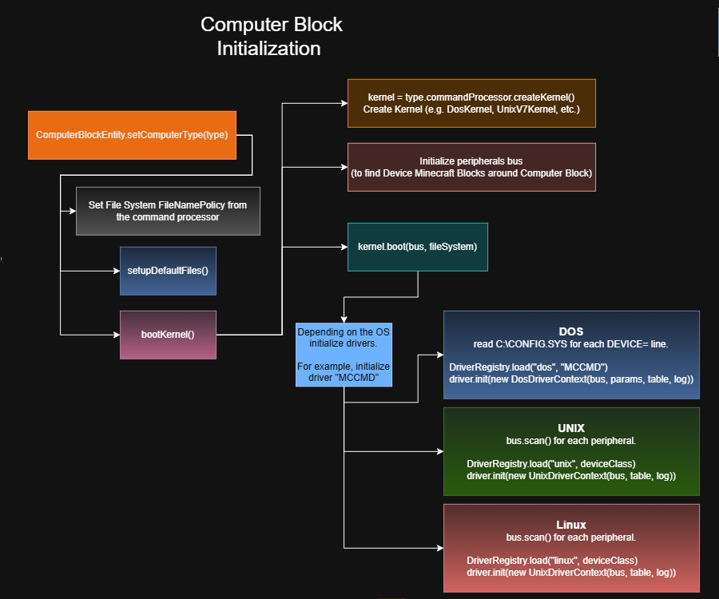

# Block Initialization

## 1.0 Purpose

This document describes how a computer block is initialized in the
"POSIX and DOS Computers" mod. It covers the registration sequence,
the block-to-block-entity binding, the machine type binding, the
default-file setup, the boot sequence, and persistence.

The intended audience is addon developers who wish to add new
computer blocks, peripheral blocks, or custom machine types.

## 2.0 Overview

A computer block passes through two distinct phases between
placement and full operation:

1. **Setup.** The block entity is created, bound to a machine type,
   and prepared: file system policy, default files, environment,
   drive bays, and machine configuration are installed.
2. **Boot.** The machine runs POST, hands off to the kernel, and
   loads drivers for attached peripherals.

A third phase, **initialization**, is the point at which the block
entity learns what kind of machine it is. This happens once, at
entity creation, and is the subject of Figure 1 in section 5.

## 3.0 Block and Block Entity Registration

### 3.1 Registration Registers

Blocks and block entities are recorded in two separate deferred
registers. Both must be attached to the mod event bus from the mod
constructor.

    public static final DeferredRegister<Block> BLOCKS =
            DeferredRegister.create(ForgeRegistries.BLOCKS, MODID);

    public static final DeferredRegister<BlockEntityType<?>> BLOCK_ENTITIES =
            DeferredRegister.create(ForgeRegistries.BLOCK_ENTITY_TYPES, MODID);

Each block is registered alongside its `BlockItem`. Each block
entity type is registered by pairing a constructor with the block
that owns it.

Failure to register a block entity, or registering it after the
block, causes a crash at world load when the game attempts to
instantiate the entity.

### 3.2 The Block Class

`IBMComputerBlock` extends `DirectionalHorizontalBlock` and
implements `EntityBlock` and `ICustomCreativeTab`. Subclasses pass a
`MachineType` to the constructor; the base class stores this and
forwards it to each entity it creates.

### 3.3 Entity Creation

When the world creates a block entity for a placed block, it calls
`newBlockEntity`:

    @Override
    public BlockEntity newBlockEntity(BlockPos pos, BlockState state) {
        ComputerBlockEntity be = new ComputerBlockEntity(pos, state);
        be.setMachineType(this.machineType);
        return be;
    }

The call to `setMachineType` is where the entity learns what kind
of machine it is.

## 4.0 Machine Type Binding

`setMachineType` performs the following work, in order:

1. Stores the type.
2. Sets the file system's `FileNamePolicy` from the command
   processor.
3. On first call only: installs default files, sets up the
   environment map, and creates drive bays.
4. Creates the default machine configuration if none exists.
5. Marks the entity as changed so the world will save it.

The "first call only" guard is the boolean field
`initializedDefaults`, which is persisted with the entity. On a
world reload, the guard prevents a re-run of the install sequence
and the loss of user data.

## 5.0 Initialization Sequence

Figure 1 shows the initialization path taken by
`setMachineType`. The figure is referred to throughout this section.

*Figure 1. Computer block initialization. The machine type is bound
once, at block entity creation. The file name policy and default
files come from the command processor. The kernel is created and
the peripheral bus is initialized; then the kernel boots and loads
its drivers according to the OS family.*

### 5.1 File Name Policy

The first branch from `setMachineType` installs the file system's
name policy. The policy is supplied by the machine type's command
processor and determines how file names are canonicalized: DOS uses
8.3 short names, POSIX uses case-sensitive long names.

### 5.2 Default Files

The second branch calls `setupDefaultFiles`. The machine type
supplies a list of file paths. Each path is resolved against the
VFS and created if missing. Two sources provide content:

- `ExecutableRegistry` supplies executable bodies for names such
  as `COMMAND.COM` or `QBASIC.EXE`.
- `ICommandProcessor.defaultFileContent` supplies text for
  configuration files such as `CONFIG.SYS` or `AUTOEXEC.BAT`.

### 5.3 Kernel Creation

The third branch calls the command processor's `createKernel`
method. The kernel is the lowest layer of the operating system and
owns the device table, the driver list, and the boot log.

If the machine type has no kernel (for example, a ROM BASIC), the
method returns `null` and the machine runs a bare shell.

### 5.4 Peripheral Bus

Before the kernel boots, a peripheral bus is constructed. The bus
is the machine's only view of attached hardware. The base mod
provides `AdjacentBlocksBus`, which enumerates the six orthogonal
neighbors of the computer block. Addons may supply a bus with a
wider reach.

### 5.5 Kernel Boot and Driver Loading

The kernel's `boot` method receives the peripheral bus and the file
system. The load sequence depends on the OS family, shown in the
three right-hand branches of Figure 1.

**MS-DOS.** The kernel reads `C:\CONFIG.SYS`. Each `DEVICE=` line
is processed in order:

1. The path is stripped to its basename.
2. The `.SYS` suffix is removed; the resulting name is used as the
   driver key.
3. Remaining tokens are parsed as load parameters.
4. A fresh `DosDriverContext` is constructed.
5. `DriverRegistry.load("dos", name)` is called. The driver's
   `init` method runs.

On failure the kernel logs a message and continues to the next
line.

**UNIX v7.** The kernel scans the peripheral bus once. For each
distinct `deviceClass`, it calls
`DriverRegistry.load("unix", deviceClass)`. One driver instance is
bound per class; multiple devices of the same class are not
supported.

**Linux.** The kernel scans the peripheral bus and, for each
peripheral, calls
`DriverRegistry.load("linux", deviceClass)`. A driver may bind
multiple matching peripherals. The kernel registers each under an
indexed device name: `/dev/plotter0`, `/dev/plotter1`, and so on.

### 5.6 A Note on the BIOS Layer

Figure 1 shows the initialization path as it stood before the BIOS
layer was added. In the current code, the sequence is wrapped:
`powerOn` runs the BIOS POST first, and only then calls
`bootKernel`. From the point of view of a running machine, the
figure remains accurate — the kernel still boots, still scans the
bus, still loads drivers — but the whole sequence is preceded by a
firmware phase that reports hardware and accepts a SETUP key.

The BIOS layer is described in the companion document
`bios_setup.md`.

## 6.0 Boot State Machine

The boot state is stored in the `BootState` enumeration:

| State   | Meaning                                                |
|---------|--------------------------------------------------------|
| OFF     | Powered down. No shell prompt.                         |
| POST    | Running BIOS power-on self test.                       |
| SETUP   | Inside BIOS SETUP. Shell prompt is inactive.           |
| RUNNING | Operating system loaded. Shell prompt is active.       |

Transitions:

- OFF → POST: `powerOn` was called.
- POST → RUNNING: the POST countdown finished or was skipped.
- POST → SETUP: the player pressed the SETUP key.
- SETUP → POST: the player saved and exited SETUP.
- RUNNING → OFF: the machine was explicitly powered down.

## 7.0 Persistence

### 7.1 NBT Save

The block entity writes the following to NBT:

- The machine type ID.
- The `initializedDefaults` guard.
- The serialized file system.
- The environment map.
- The drive bays.
- The boot state.
- The machine configuration.

### 7.2 NBT Load

On load, if the machine type ID is missing or unresolvable, the
load falls back to the mod's default machine type. If the file
system is missing but the guard is unset, the load runs default
setup. This is a defensive path for entities saved by very old
versions of the mod.

### 7.3 World Reload

The block entity's `load` runs before the world begins ticking.
The entity is fully populated by the time its tick method first
runs.

## 8.0 Removal

The block entity overrides `setRemoved` to shut down its kernel.
Drivers are unloaded, open devices are released, and any references
to peripherals are cleared. The block entity must not attempt to
unregister blocks, items, or block entities; registration is global
and immutable for the lifetime of the game.

## 9.0 Writing a New Computer Block

1. Create a subclass of `IBMComputerBlock` if the block behaves
   like a computer. Otherwise create a plain `Block` that
   implements `EntityBlock`.
2. Create the block entity class. If the machine shares the base
   `ComputerBlockEntity` fields, extend it. Otherwise extend
   `BlockEntity` directly.
3. Register the block and its block item.
4. Register the block entity type against the block.
5. If a custom machine type is used, register it with
   `MachineTypeRegistry` during `FMLCommonSetupEvent`.
6. Add the block to the appropriate creative tab via
   `ICustomCreativeTab` or the tab registration event.

## 10.0 Reference

### 10.1 Classes and Interfaces

- `IBMComputerBlock` — base computer block.
- `ComputerBlockEntity` — block entity that owns machine state.
- `MachineType` — interface describing a machine.
- `MachineTypeRegistry` — global registry of machine types.
- `ICommandProcessor` — shell and command language of an OS.
- `Kernel` — lowest layer of an operating system.
- `PeripheralBus` — enumeration of attached hardware.
- `DriverRegistry` — registry of driver factories.
- `BootState` — enumeration of boot states.
- `MachineConfig` — BIOS-level configuration record.

### 10.2 Registration Order

The correct order of registration during mod setup is:

1. Items.
2. Blocks.
3. Block entities.
4. Network packets.
5. Machine types.
6. Drivers and executables.

### 10.3 Common Errors

| Symptom                            | Likely cause                                          |
|------------------------------------|-------------------------------------------------------|
| Missing block in world             | Block not registered, or registry not attached.       |
| Missing block entity               | Block entity type not registered, or not paired.      |
| Null machine type at boot          | `setMachineType` not called, or type ID unresolvable. |
| Default files reappear after reset | `initializedDefaults` guard not persisted.            |
| Kernel is null at first tick       | `powerOn` not called, or `bootFromBios` returned early.|
| Driver does not load on DOS        | `CONFIG.SYS` missing or `DEVICE=` line malformed.     |
| Driver loads on UNIX but not Linux | Registry key uses OS family mismatch.                 |
