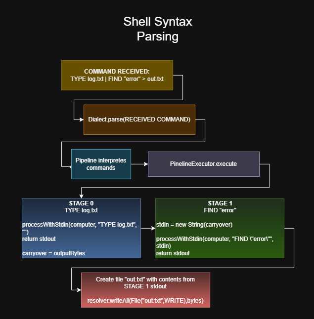
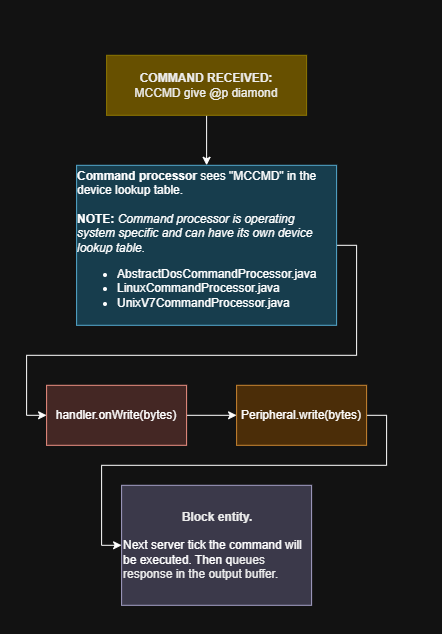

# Shell Command and Syntax Processor

The client sends a `ServerboundCommandPacket` containing the block position and the raw line.

The server receives the packet on the game thread, looks up the block entity, and calls `ComputerBlockEntity.executeLine(rawLine)`.

`executeLine(...)` starts by asking the command processor for its shell dialect. See "Syntax processor" below.

## Command Process order

Depending on the Operating System (command processor) the order in which possible executable command is found may differ.

`commandProcessor.process` processes the command in these possibles orders.

- For MS-DOS (`AbstractDosCommandProcessor`) it will be:

**[INSERT .PNG GRAPH IMAGE]**

- For Linux (`LinuxCommandProcessor`) it will be:

**[INSERT .PNG GRAPH IMAGE]**

- For Unix V7 (`UnixV7CommandProcessor`) it will be:

**[INSERT .PNG GRAPH IMAGE CUZ THEY LOOK BEAUTIFULLLLLL]**

## Syntax processor

Command processor returns an OS-specific `Dialect` class.
For MS-DOS: `DosShellDialect`; For UNIX v7: `UnixV7Dialect`; For Linux: `BashDialect`.

Each dialect knows what operators its shell supports. (For example, DOS has `>`, `>>`, `<`, `|`, and `;;`; UNIX v7 has those plus `&` for background; Linux has `&&`, `||`, `[[ ... ]]` and many more.)

The dialect parses the line into a `Pipeline`. For our example let's attempt to execute `TYPE log.txt | FIND "error" > out.txt` on MS-DOS 6.0 which has two Stage objects. The first has command **TYPE**, args **LOG.TXT**, and a stdout redirect `|`. The second has command **FIND**, args "error", and a stdout redirect that targets the file **OUT.TXT** in write mode. The pipe between them is recorded in the pipeline's between list.

`PipelineExecutor.execute` iterates over the stages.

**For stage one**, it determines stdin: nothing has been piped in yet, and there's no < file redirect, so stdin is empty. It calls `commandProcessor.processWithStdin(computer, "TYPE LOG.TXT", "")`.

Inside the MS-DOS command processor, `processWithStdin` stashes the stdin string in a field and delegates to the normal process method. That method does its dispatch in order:
1. It tries version-specific handlers - on MS-DOS 6.0, **MOVE** and **DELTREE**; on MS-DOS 3.3, the newer commands return `Bad command or file name`.
2. It tries the help system - if the args were `/?`, the processor would return the help text for **TYPE** and stop.
3. It tries the device table - the kernel's `getDevices().isDevice("TYPE")` returns `false` because no driver registered a device named **TYPE**.
4. It tries the executable registry - walks the `PATH` from the environment, splits on ;, and looks for **TYPE.EXE** or **TYPE.COM** or **TYPE.BAT** in each directory. There is none.
5. Finally it falls through to the **built-in** switch and matches case `"TYPE": return doType(vfs, arg)`. The `doType` method resolves **LOG.TXT** in the current directory and returns its content as a string.

The executor catches that string, converts it to bytes, and - because the pipe operator sits between stage one and stage two — stores it as `carryover`.

**For stage two**, the executor determines stdin from the `carryover`. It calls `processWithStdin(computer, "FIND ERROR", <file content>)`. The MS-DOS processor's dispatch again runs in order. **FIND** isn't version-specific, isn't a help request, isn't a device, isn't an executable in **PATH**. It falls to the switch, matches case `"FIND": return doFind(pendingStdin, arg)`, and `doFind` scans each line of stdin for the substring "error". Matching lines come back formatted with a leading `---------- <n>: prefix`.

But this stage has a `Redirect.File("OUT.TXT", WRITE)`. The executor doesn't print the result to the terminal - it outputs the bytes to the `StreamResolver`. Because the redirect is a `File` and not a `Device`, the resolver canonicalizes the name via the filesystem's policy (**OUT.TXT** is already canonical), finds or creates the node in the current directory, writes the text into its content field, and calls `setChanged()` so the block entity schedules a save.

The final String returned by the executor is empty - the output went to a file, not to the terminal. The server packages this in a `ClientboundTerminalOutputPacket` along with the current directory path, and sends it back.

The client receives the packet. `ComputerTerminalScreen.appendOutput` checks the string for special prefixes. It isn't `__CLEAR__`, and it doesn't start with `APP_LAUNCH:`, so it just appends the (empty) lines to the scrollback. The prompt redraws with the current directory.

**The process graph:**

## Driver Command Processor

For our example let's attempt to execute `MCCMD give @p diamod` on MS-DOS 6.0

Normal process method is called. That method does its dispatch in order:
1. It tries version-specific handlers - on MS-DOS 6.0, **MOVE** and **DELTREE**; on MS-DOS 3.3, the newer commands return `Bad command or file name`.
2. It tries the help system - if the args were `/?`, the processor would return the help text for **TYPE** and stop.

3. It tries the device table - the processor asks the kernel:
   `kernel.getDevices().isDevice("MCCMD")`. The MS-DOS kernel's device
   table contains every name that a driver registered at boot:
   `CON`, `NUL`, `PRN`, `AUX`, and - because `MCCMD.SYS` loaded
   successfully - `MCCMD`.

   Processor decides this is a device command. The check happens

   The lookup returns a `DeviceHandler`. This handler was installed by
   `DosMccmdDriver.init()` when it called
   `ctx.registerDevice("MCCMD", DeviceHandler.of(peripheral))`.

4. The processor writes the argument bytes plus a trailing newline: `handler.onWrite((argRaw + "\n").getBytes(StandardCharsets.UTF_8));`

   For the default handler built by `DeviceHandler.of`, `onWrite` delegates straight to `Peripheral.write(bytes)`. In our example the peripheral will be `MinecraftCommandTranslatorBlockEntity` and its write method queues the bytes into a pendingInput buffer.

   The command has been delivered to the hardware.

5. The peripheral block entity executes on the next tick. Every tick, the `MCCMD` peripheral block entity drains its input buffer. `MinecraftCommandTranslatorBlockEntity.processPendingCommands` splits the buffer on newlines, strips any `/`, and runs each line as a Minecraft command via `MinecraftServer.getCommands().performPrefixedCommand(...)`.

   In our example we attempted to execute `give @p diamond` which runs succesfully.

**The process graph:**

