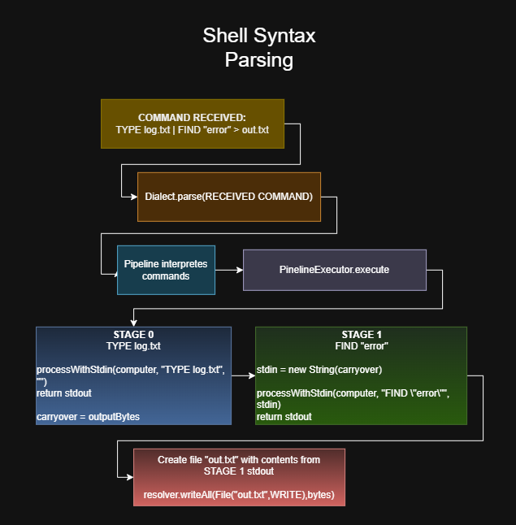
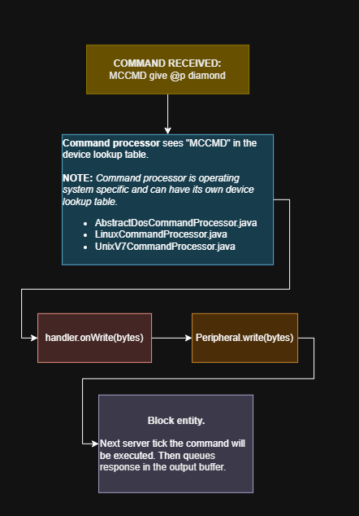

# Shell and Command Language

## 1.0 Purpose

This document describes how commands are received, parsed, and
executed in the "POSIX and DOS Computers" mod. It explains the
command processor, the shell dialect, the pipeline executor, the
stream resolver, and the device command routing path.

The intended audience is addon developers implementing a new shell,
a new pipeline stage, or a new device command.

## 2.0 Overview

Every machine has one *command processor* per OS family. The
processor owns three responsibilities:

1. Parse a command line into a pipeline of stages.
2. Execute each stage with the correct stdin and stdout.
3. Route the final output back to the terminal, a file, or a
   device.

The command processor is backed by a *shell dialect*, which supplies
the grammar, and by a *stream resolver*, which supplies the file
and device I/O. A pipeline is executed by a `PipelineExecutor`
instance constructed with both.

Two figures are used in this document. Figure 1 shows how a
command that names a device reaches the device. Figure 2 shows how
a pipeline is parsed and executed stage by stage.

## 3.0 The ICommandProcessor Interface

Interface name: `com.eliaslucky.mc_dos.blocks.computer.processors.ICommandProcessor`

Methods:

- `process (ComputerBlockEntity, String) returns String` — Execute
  a single command line and return the terminal output. Called for
  commands with no piped stdin.

- `getPrompt (String) returns String` — The prompt shown before the
  cursor. The argument is the current working directory.

- `defaultPath () returns String` — The default search path for
  executables, as a PATH-style string.

- `fileNamePolicy () returns FileNamePolicy` — Naming rules for
  files and directories.

- `osFamily () returns String` — Bucket key for executables and
  drivers. Standard values: `"dos"`, `"unix"`, `"linux"`.

- `createKernel () returns Kernel` — Factory for the OS kernel.
  May return `null` for a bare shell.

- `shellDialect (Kernel) returns ShellDialect` — The shell grammar.

- `createStreamResolver () returns StreamResolver` — Factory for
  the resolver that handles redirection and pipe carry-over.

- `processWithStdin (ComputerBlockEntity, String, String)
  returns String` — Same as `process`, but with stdin supplied by a
  pipe or a `<` redirect. The default implementation ignores stdin.

- `defaultFileContent (String) returns String` — Content for
  well-known files seeded at install time.

## 4.0 The Shell Dialect

Abstract class: `com.eliaslucky.mc_dos.api.shell.ShellDialect`

A dialect supplies the grammar for one shell language. The base
class provides a template method that parses a command line into a
`Pipeline`. Subclasses implement `makeRedirect` to decide whether a
bare name is a device or a file.

Methods:

- `name () returns String` — Human-readable name.

- `parse (String) returns Pipeline` — Parse a command line into a
  pipeline. The default implementation splits on the pipe character
  and builds one stage per segment.

- `makeRedirect (String target, Redirect.Mode mode)
  returns Redirect` — Classify a redirect target. Return
  `Redirect.Device` if the kernel recognises the name as a device;
  otherwise return `Redirect.File`.

Dialects in the mod:

| Dialect            | OS family | Notes                                    |
|--------------------|-----------|------------------------------------------|
| `DosShellDialect`  | dos       | `>`, `>>`, `<`, `|`, and `;` (batch).    |
| `BourneV7Dialect`  | unix      | The V7 Bourne shell grammar.             |

## 5.0 Pipeline Parsing

Figure 2 shows a command with two stages, a pipe, and a redirect.
The dialect parses the line into a pipeline, the executor runs each
stage in order, and the final stage's stdout is written to the
redirect target.

*Figure 2. Pipeline parsing and execution. The command
`TYPE log.txt | FIND "error" > out.txt` is parsed into two stages.
Stage 0 runs `TYPE` with no stdin. Its output becomes Stage 1's
stdin. Stage 1 runs `FIND "error"`. Its output is written to the
file `out.txt` by the resolver.*

### 5.1 Stages

A pipeline is an ordered list of stages. Each stage has:

- The command text, as typed.
- The command word (the first token).
- Any arguments.
- The stdin source (`None`, `Pipe`, or `Redirect.File`).
- The stdout sink (`None`, `Pipe`, or `Redirect.File` or
  `Redirect.Device`).

The parser determines stdin and stdout by position: the stage
before a pipe provides stdin for the stage after it; a redirect
attaches to the stage it appears in.

### 5.2 The Executor

The pipeline executor walks the stages in order. For each stage it
calls `processWithStdin` on the command processor, passing the
previous stage's stdout as the stdin argument. If the stage is the
first, stdin is the empty string. If the stage is the last, the
output goes to the terminal or to the final redirect target.

### 5.3 Redirect Targets

A redirect target is either a file or a device. The dialect
classifies it via `makeRedirect`, which consults the kernel's
`DeviceLookup`. The DOS dialect, for example, treats `PRN`, `NUL`,
and any driver-registered name as a device; everything else is a
file.

## 6.0 Stream Redirection

Interface name: `com.eliaslucky.mc_dos.api.shell.StreamResolver`

The resolver is the interface between the pipeline executor and
the file system. It has two methods:

- `readAll (Redirect source, ComputerBlockEntity computer)
  returns byte[]` — Read all bytes from a source. If the source is
  a device, the kernel's device handler is queried. If the source
  is a file, the VFS is queried.

- `writeAll (Redirect sink, byte[] data, ComputerBlockEntity
  computer) returns void` — Write all bytes to a sink. If the sink
  is a device, the handler's `onWrite` is called. If the sink is a
  file, the VFS is written.

The DOS resolver also handles the append mode for `>>` by reading
the existing file, concatenating, and writing back.

## 7.0 Device Command Routing

When a command word names a device rather than an executable, the
command processor dispatches through the kernel's device table
instead of the executable registry.

Figure 1 shows the routing path.

*Figure 1. Device command routing. The command processor recognises
the command word as a device name and looks it up in the kernel's
device lookup table. The handler's `onWrite` method is called,
which forwards to the peripheral's `write` method. The peripheral
queues the bytes for processing on the next server tick.*

### 7.1 The Lookup Table

The kernel exposes a `DeviceLookup` interface with three methods:

- `isDevice (String) returns boolean` — Whether a name is a
  registered device.

- `lookup (String) returns DeviceHandler` — Resolve a name to its
  handler.

- `names () returns List<String>` — All registered device names.

The command processor calls `isDevice` before consulting the
executable registry. If the name is a device, the processor
retrieves the handler and calls `onWrite` with the argument bytes.

### 7.2 The Handler

`DeviceHandler` is the application-facing view of a device. Its
`onWrite` method receives bytes; its `onRead` returns bytes. The
default implementation forwards to a `Peripheral`. Drivers that
need to transform data on the way through implement a custom
handler.

### 7.3 The Peripheral

`Peripheral` is the hardware-facing interface. Its `write` method
accepts bytes without blocking. Its `read` method returns up to a
requested number of bytes. The peripheral queues bytes for
processing on the next server tick.

### 7.4 Tick-Ordered Execution

A peripheral that receives bytes does not process them
synchronously. It queues them and processes them on the next
server tick. This is deliberate: the terminal's response arrives
one tick later, which matches the turnaround time of a real
printer or plotter and prevents the game thread from blocking
during a long device operation.

## 8.0 Built-in Commands

Built-in commands are implemented directly in the command
processor rather than as executables. They are available even when
the file system is unavailable or empty.

The DOS command processor supplies the following built-ins:

| Command   | Effect                                          |
|-----------|-------------------------------------------------|
| `CD`      | Change working directory.                       |
| `DIR`     | List directory contents.                        |
| `CLS`     | Clear the terminal screen.                      |
| `TYPE`    | Print a file's contents.                        |
| `COPY`    | Copy a file.                                    |
| `DEL`     | Delete a file.                                  |
| `VER`     | Print the OS version string.                    |

The UNIX command processor supplies equivalents in the traditional
V7 style.

## 9.0 Writing a New Command

To add a new built-in command to an existing OS:

1. Add the command name to the processor's dispatch table.
2. Implement the command as a method that takes the machine and the
   argument string and returns the terminal output.
3. If the command reads stdin, override `processWithStdin` in the
   processor or ensure the built-in checks for a non-empty stdin.

To add a new executable to an existing OS:

1. Register the executable with `ExecutableRegistry`.
2. Provide a `Runner` that receives the machine, the argument
   string, and the file node.
3. Return the terminal output as a string. To launch a client-side
   TUI application, prefix the return value with `APP_LAUNCH:`.

## 10.0 Reference

### 10.1 Classes and Interfaces

- `ICommandProcessor` — OS-specific command language.
- `ShellDialect` — Grammar for one shell language.
- `Pipeline` — Ordered list of stages.
- `PipelineExecutor` — Runs a pipeline stage by stage.
- `StreamResolver` — Reads and writes redirect targets.
- `Redirect` — Source or sink for a stage.
- `DeviceLookup` — Kernel device namespace.
- `DeviceHandler` — Application-facing device interface.
- `Peripheral` — Hardware-facing byte stream.

### 10.2 Redirect Forms

| Syntax      | Meaning                                              |
|-------------|------------------------------------------------------|
| `> file`    | Write stdout to file, truncating.                    |
| `>> file`   | Append stdout to file.                               |
| `< file`    | Read stdin from file.                                |
| `cmd | cmd` | Pipe stdout of one stage to stdin of the next.       |
| `> dev`     | Write stdout to a device (DOS only).                 |
| `;`         | Sequential execution (DOS batch only).               |

### 10.3 Common Errors

| Symptom                              | Likely cause                                     |
|--------------------------------------|--------------------------------------------------|
| Command not recognised               | Name not registered as executable or device.     |
| Redirect target silently ignored     | Dialect returned `Redirect.File` for a device, or the resolver cannot find the file's parent. |
| Pipeline drops output                | `processWithStdin` not overridden to read stdin. |
| Device never responds                | Peripheral queues bytes but does not process them on tick. |
